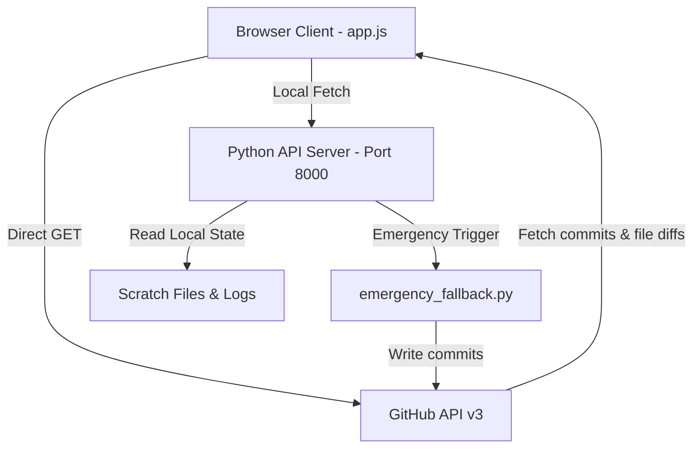

# 🚀 Gitobit — Live Cloud Automation & Developer Telemetry Monitor

**Gitobit** is a premium, high-fidelity SaaS-style developer telemetry dashboard. It provides real-time, zero-dependency client-side tracking of GitHub commits, LeetCode synchronization progress, and Daily DSA challenge completions across multiple developer profiles.

---

## 🎨 Design System & Visual Aesthetics
Gitobit is crafted following premium modern web design principles:
- **Liquid Glass Navbar**: A sticky top header utilizing high-intensity `backdrop-filter: blur(50px)` with crisp inset highlight borders and semi-transparent visual panels.
- **High-Contrast SaaS Cards**: Solid white (`#ffffff`) card layouts outlined in slate borders (`#e2e8f0`) on a soft slate off-white background (`#f8fafc`), ensuring optimal readability and preventing elements from blending with the background.
- **Electric Brand Blue Theme**: Incorporates dynamic gradient glows in the top-left and an animated, color-graded liquid glass orb.
- **Typography Hierarchy**: Uses `Fustat` (bold, geometric brand headers) and `Inter` (subpixel antialiased UI text and labels).
- **Responsive Mobile Layout**: Automatic stacking and fluid scaling rules allowing desktop tables and sidebar widgets to align cleanly on mobile viewports.

---

## 🛠️ System Architecture & Data Flow

Gitobit is architected as a decoupled hybrid system combining direct-to-GitHub client calls with a lightweight local helper service.



### 1. Direct-to-GitHub Frontend Pipeline (`app.js`)
- **Direct Queries**: Fetching commits list and workflow run updates directly from GitHub API v3, ensuring real-time "cricket score" updates.
- **12-Hour IST Clock**: Formats all timestamps, action checks, and last-updated metrics into Indian Standard Time 12-hour format (AM/PM) using `Intl.DateTimeFormat` with `Asia/Kolkata` offsets.
- **Insights Footprint Modal**: On clicking any repository row, the client asynchronously retrieves the latest commit SHA, requests the specific commit diff from the GitHub API, and lists the exact files changed.
- **Proactive Fallbacks**: Graceful fallback values and connection warnings to prevent page freezes during rate-limits or offline periods.

### 2. Local Helper Service (`server.py` & API)
- **Decrypted Token Loader (`/api/tokens`)**: Loads GitHub Personal Access Tokens (PATs) locally from private scratch files. It exposes them to the local web app on startup, keeping PAT strings secure and out of public Git histories.
- **Local State Reader (`/api/local-state`)**: Serves local files like `dsa_progress.json`, `leetcode_sync_idx.json`, and `railflow_state.json` directly to the browser for instant metrics update.
- **Auto-Recovery Trigger Engine (`/api/emergency-trigger`)**:
  - Automatically activates if the client detects it is past **5:00 PM IST** on a scheduled weekday rotation.
  - Checks if the current target repository has `0` commits.
  - If pending, it calls the local POST API to run `emergency_fallback.py`, executing two README commits (adding and clearing a sync marker) to ensure daily developer contribution streaks are maintained.
  - Uses `localStorage` caching to restrict triggers to a maximum of **once per day per repository**.
- **CORS & Preflight Handling**: Implements `do_OPTIONS` preflight request listeners and custom access control response headers to allow safe cross-origin triggers from local browser tabs.

---

## 📅 Weekly Rotation Schedule
Gitobit orchestrates repository rotations across active days, flagging rest periods:

| Profile | Monday | Tuesday | Wednesday | Thursday | Fri - Sun |
| :--- | :--- | :--- | :--- | :--- | :--- |
| **Sriram** | Hiresense.ai | Javino-AI-Authenticity | SmartSlate | Sriram-Portfolio | 💤 Rest Day |
| **Suriya** | smart-ai-resume-analyser | Suriya-portfolio- | Accerdian-dashboard | unipay | 💤 Rest Day |
| **Rizz** | ROI-THE-LEGAL-APP | Study-and-Code | RailFlow | Study-and-Code | 💤 Rest Day |

---

## 🚀 Running Locally

### 1. Start the Telemetry Server
Execute the server script to serve the dashboard and API endpoints:
```bash
python C:\gitupdater\dashboard\server.py
```
*Serves the application statically on: **[http://localhost:8000](http://localhost:8000)***

### 2. File Checkpoints & State Storage
The server reads and writes logs at:
- **DSA Progress**: `C:\gitupdater\logs\dsa_progress.json`
- **LeetCode Sync**: `C:\Users\iamra\.gemini\antigravity\brain\<conversation_id>\scratch\leetcode_sync_idx.json`
- **RailFlow State**: `C:\Users\iamra\.gemini\antigravity\brain\<conversation_id>\scratch\railflow_state.json`
